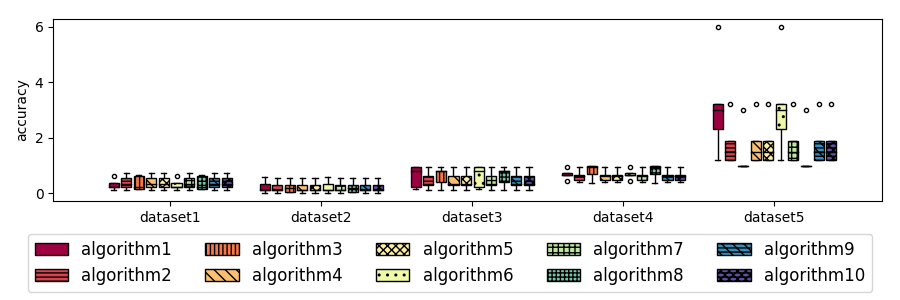
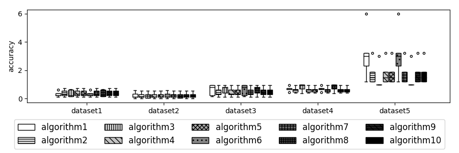
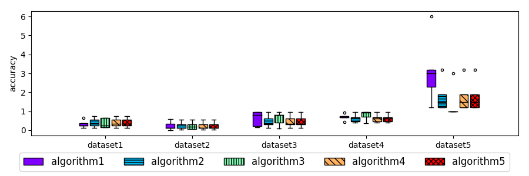
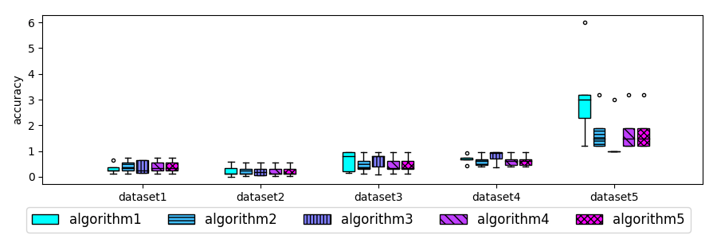
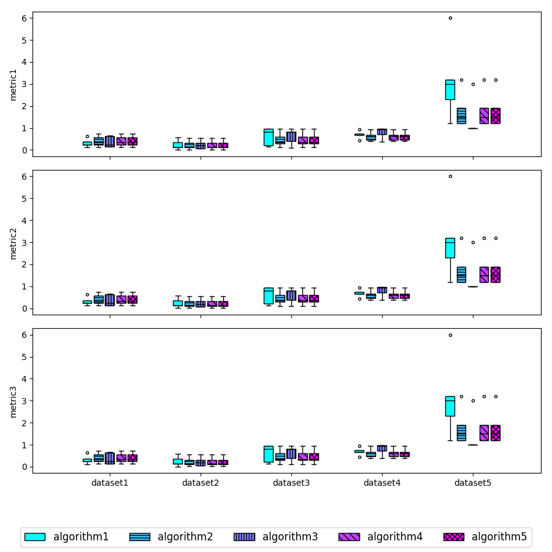

# auto_plotter

Simple auto plotting library to provide *cool looking* graphs

## Includes:
  - Utils class
  - Boxplot

## To install:
  - pip install . --user

## Examples

  

  

  

  

  

## TODO:
  - Line plot
  - Barplot
  - Spider plot
  - And other plots

